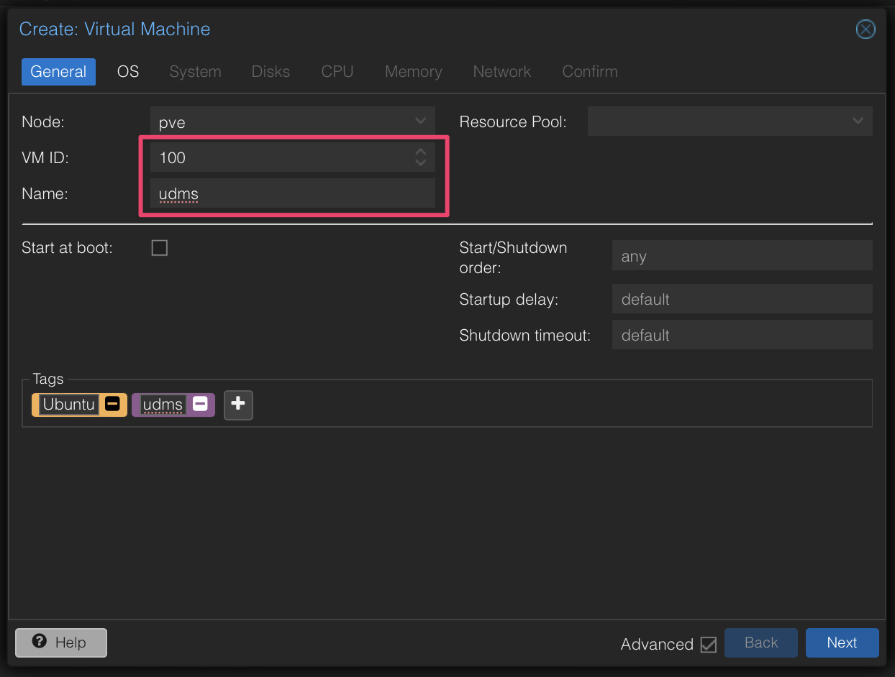
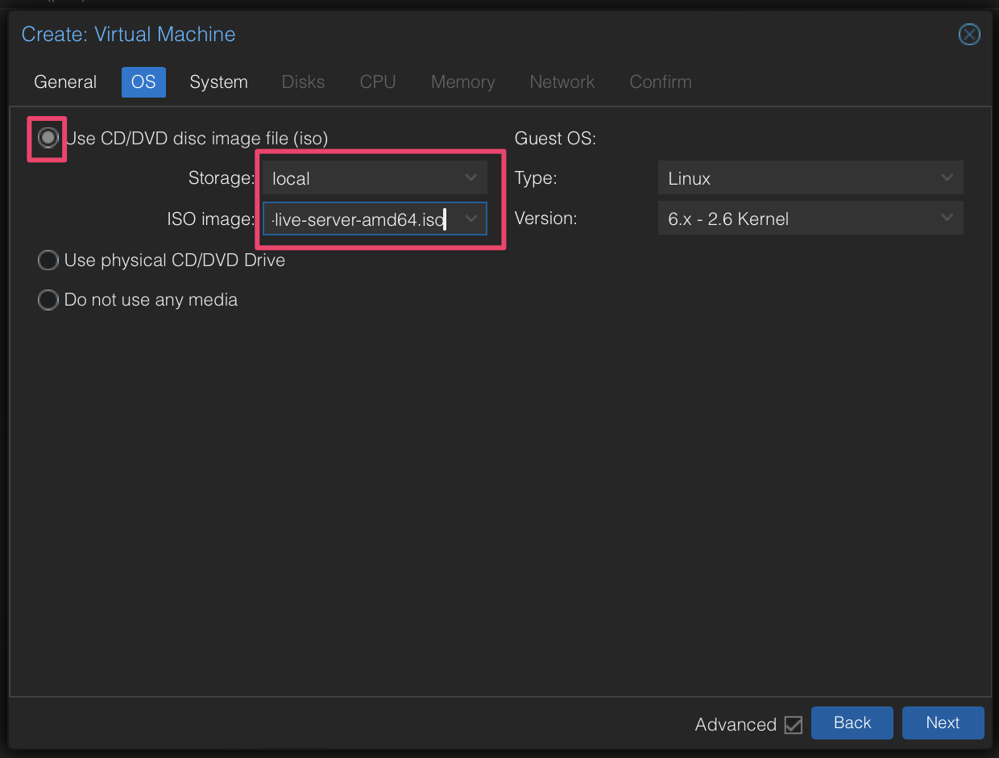
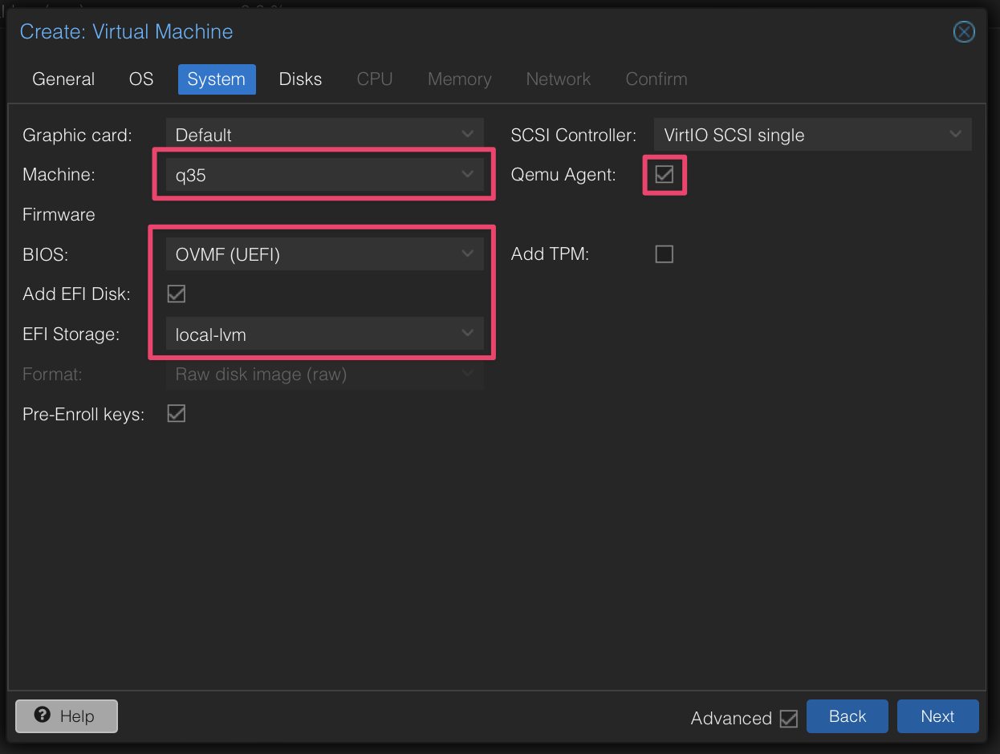
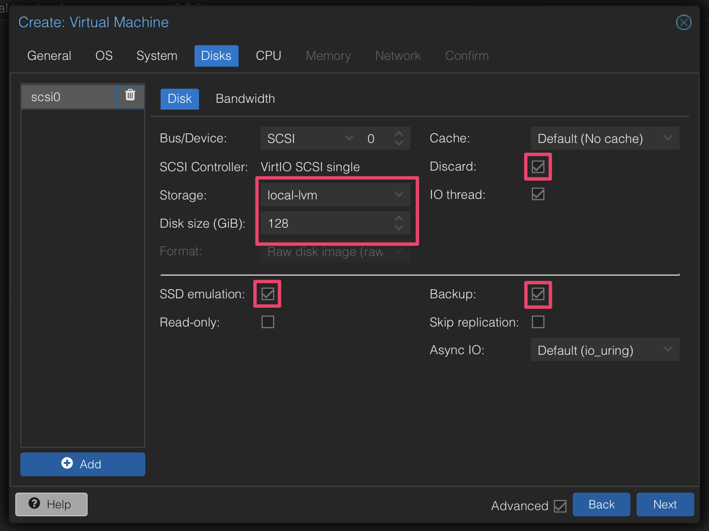
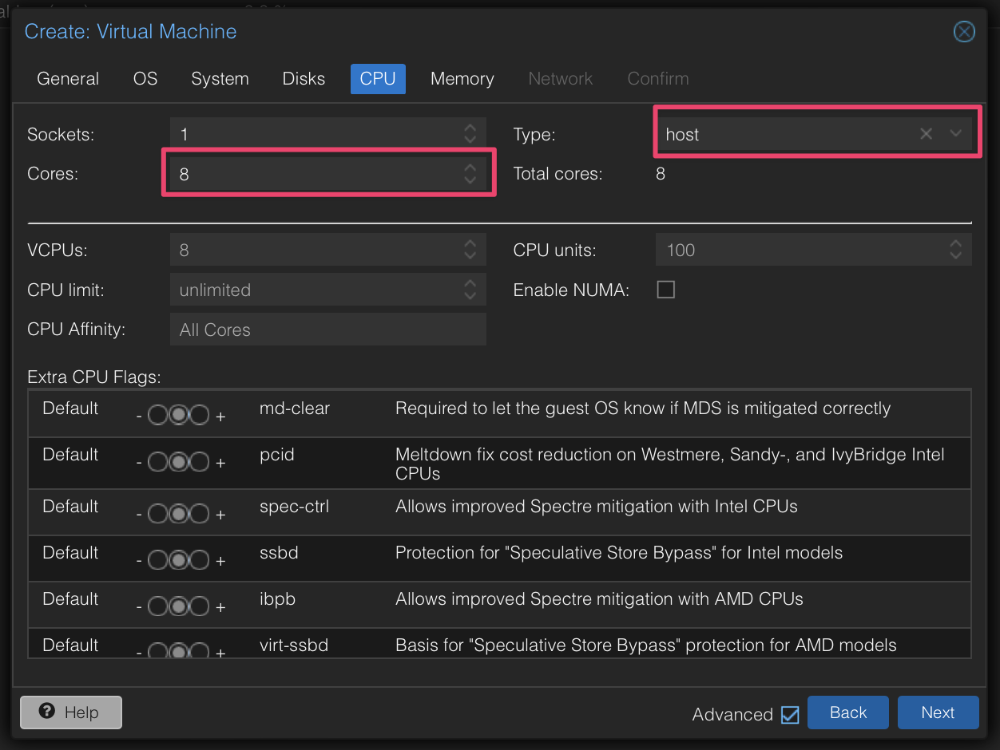
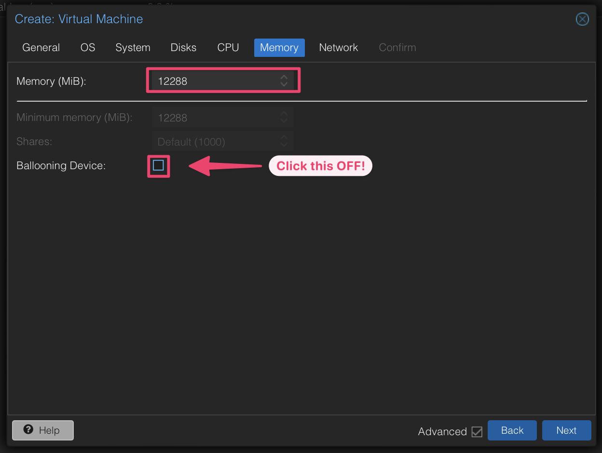
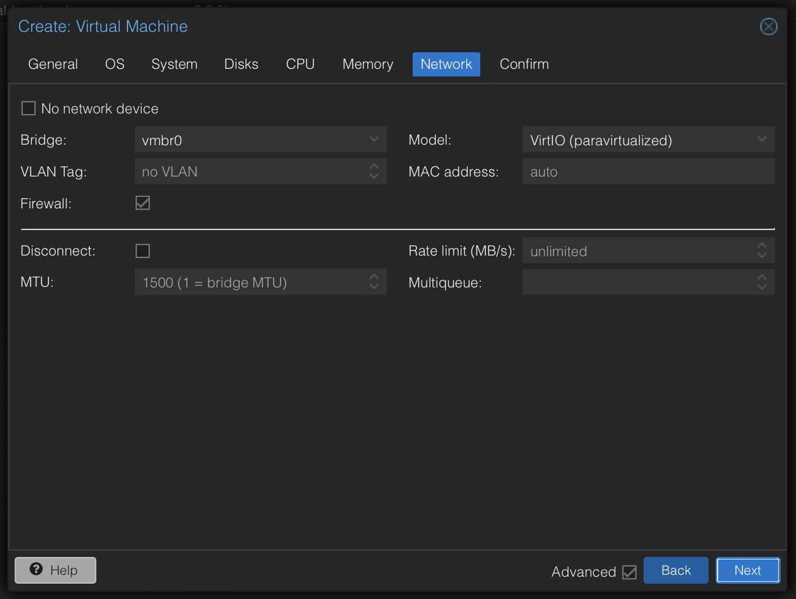
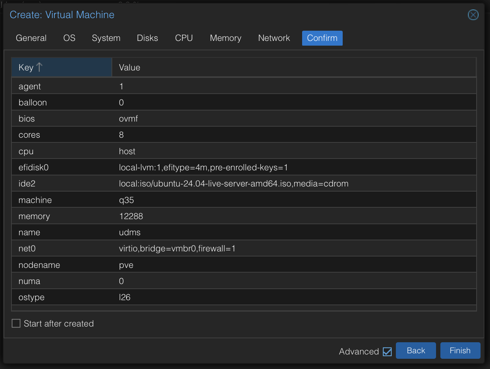

3 - Ubuntu VM installation within Proxmox
==========================================
There are (2) methods to install Ubuntu Server OS and I prefer the ***Server Live ISO install*** over the Cloud-Init Server install. The Live install takes about the same amount of time to install as the Cloud-Init version, at least if you are only building one VM. And you don't have to remember where to go in the Proxmox GUI for the VM cloud init settings, and what to do in the VM terminal after install.

# Server Live ISO install (preferred by me)

## Upload the Live Install ISO to Proxmox
1. In the Promox GUI, got to `pve --> local (pve) --> ISO Images` and click `Download from URL`
2. Enter this URL in the `URL:` field
   
   `https://releases.ubuntu.com/24.04/ubuntu-24.04-live-server-amd64.iso`
3. Click the `Query URL` button
4. Click the `Download` button

The task viewer will open with the download status. Drink some coffee while it downloads!

## Set up the VM
1. In the Promox GUI, click on `pve` and then click on the `Create VM` button

   The `Create: Virtual Machine` popup will appear
2. Enter General settings
   
```yaml
   `VM ID: 100`
   `Name: udms`
```
   
   
   

3. Enter OS settings

Choose your ISO image.
   

4. Enter System settings

```yaml
   `Machine: q35`
   `BIOS: OVMF (UEFI)`
   `Add EFI Disk: YES`
   `EFI Storage: local-lvm`
   `SCSI COntroller: VirtIO SCSI single`
   `Qemu Agent: YES`

```
   

5. Enter Disks settings

```yaml
   `Storage: local-lvm`
   `Disk size (GiB): 128`
   `Discard: YES`
   `SSD emeulation: YES`
   `Backup: YES`
```
   

6. Enter CPU settings

```yaml
   `Cores: 8`
   `Type: host`
```
   

7. Enter Memory settings

```yaml
   `Memory (MiB): 12288`
   `Ballooning Device: NO/OFF`
```
   

8. Enter Network settings

Use default settings.

   

9. Check and Confirm

   


# Cloud-Init Server install using Tteck script

>**NOTE** I do NOT prefer this way because, for iGPU passthrough, the required files in `linux-generic` are not part of the Ubuntu Cloud-Init distribution used by the Tteck Ubuntu installation script. That means we have to remember to load them using `sudo apt install sudo linux-generic` after starting the VM for the first time.

NOTE: linux-generic is required to enable GPU passthrough from Proxmox to the Ubuntu VM. It is not included in the Ubuntu Cloud-Init distribution used by the Tteck Ubuntu installation script.

## 
Run Tteck Ubuntu 24.04 script at https://helper-scripts.com/scripts?id=Ubuntu+24.04
> NOTE: Run TTeck scripts from Proxmox GUI shell, not SSH!
```shell-script
bash -c "$(wget -qLO - https://github.com/tteck/Proxmox/raw/main/vm/ubuntu2404-vm.sh)"
```
## Setup Cloud-Init on Proxmox
> WARNING: Do NOT start the VM until after you do the following Cloud-Init setup steps!


**Follow the detailed instructions at** https://github.com/tteck/Proxmox/discussions/2072 

## Start the VM
----
