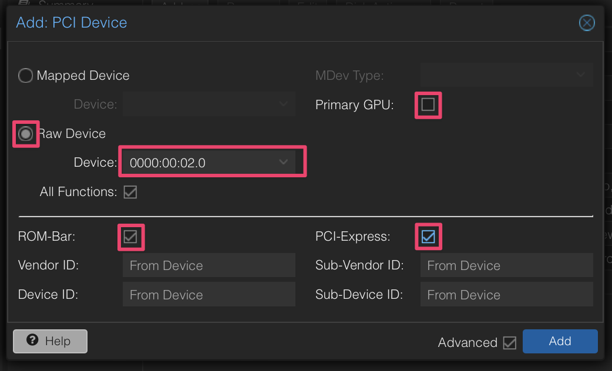
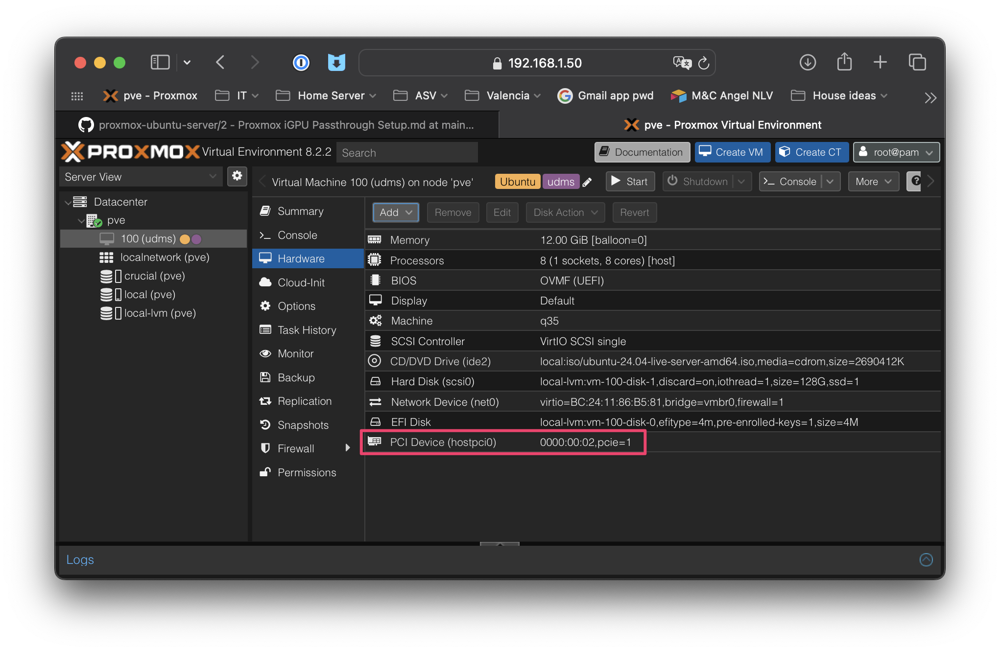

3 - iGPU Hardware Passthrough Setup
============================================
> **NOTE:** Most of these steps can be done before or after you have created a VM.
>
> **SOURCES:**
> 1. iKoolcore R2 script code at https://github.com/KoolCore/Proxmox_VE_Status/blob/main/passthrough.sh
> 2. Craft Computing video at https://www.youtube.com/watch?v=_hOBAGKLQkI 

Executing the iKoolcore R2 hardware passthrough script at https://github.com/KoolCore/Proxmox_VE_Status did not work for me. It ran but didn't make the file changes. Instead, I created these steps manually from the script source code at https://github.com/KoolCore/Proxmox_VE_Status/blob/main/passthrough.sh. 

Also, the Craft Computing video at https://www.youtube.com/watch?v=_hOBAGKLQkI follows these steps almost exactly, with the only difference being the changes to `/etc/kernel/cmdline`.

# Within the Proxmox Host

## Make IOMMU changes at boot
>**NOTE:** There are two possible boot systems, Systemd (EFI) or Grub.
>
>**NOTE:** The **'Boot Mode'** in the Proxmox GUI summary page for a node (like `pve`) indicates whether it is EFI (systemd) or Grub booted.

I chose to do both the Grub and EFI steps below.

### For Grub boot, edit `/etc/default/grub`
1. Open `/etc/default/grub`
``` sh
nano /etc/default/grub
```
2. Change this line to:
```EditorConfig
GRUB_CMDLINE_LINUX_DEFAULT="quiet intel_iommu=on iommu=pt"
```
3. Save file and close

4. Run:
```sh
update-grub
```
### For Systemd (EFI) boot, edit `/etc/kernel/cmdline`
> **NOTE:** These steps are for EFI boot systems.

1. Open `/etc/kernel/cmdline`
```sh
nano /etc/kernel/cmdline
```
2. Add this to first line:

>**NOTE** All commands in `/etc/kernel/cmdline` must be in a **single line** on the **first line!**
```EditorConfig
intel_iommu=on iommu=pt
```
3. Save file and close

4. Run:
```sh
proxmox-boot-tool refresh
```
## Load VFIO modules at boot
1. Open `/etc/modules`
```sh
nano /etc/modules
```

2. Add these lines:
```
vfio
vfio_iommu_type1
vfio_pci
vfio_virqfd
```

3. Save file and close

## Configure VFIO for PCIe Passthrough

1. Find your GPU PCI identifier
   
   It will be something like `00:02`
```sh
lspci
```

2. Find your GPU's PCI HEX values

   Enter the PCI identifier (`00:02`) from above into the `lspci` command: 
```
lspci -n -s 00:02 -v
```
You will see an associated HEX value like `8086:46d0`

3. Edit `/etc/modprobe.d/vfio.conf`

   Copy the HEX values from your GPU into this command and hit enter:
```sh
echo "options vfio-pci ids=8086:46d0 disable_vga=1"> /etc/modprobe.d/vfio.conf
```

4. Apply all changes
```sh
update-initramfs -u -k all
```

## Blacklist Proxmox host device drivers

This ensures nothing else on Proxmox can use the GPU that you want to pass through to a VM.

1. Edit `/etc/modprobe.d/iommu_unsafe_interrupts.conf`
```sh
echo "options vfio_iommu_type1 allow_unsafe_interrupts=1" > /etc/modprobe.d/iommu_unsafe_interrupts.conf
```

2. Edit `/etc/modprobe.d/blacklist.conf`
```sh
echo "blacklist nouveau" >> /etc/modprobe.d/blacklist.conf
echo "blacklist nvidia" >> /etc/modprobe.d/blacklist.conf
```

3. Apply all changes
```sh
update-initramfs -u -k all
```

4, Reboot to apply all changes
```sh
reboot
```

## Verify all changes

1. Verify `vfio-pci` kernel driver being used: 
```sh
lspci -n -s 00:02 -v
```

   In the output, you should see: 
   ```yaml
   Kernel driver in use: vfio-pci
   ```
2. Verify IOMMU is enabled:
```shell-script
dmesg | grep -e DMAR -e IOMMU
```
   In the output, you should see: 
   ```yaml
   DMAR: IOMMU enabled
   ```
3. Verify IOMMU interrupt remapping is enabled:
```shell-script
dmesg | grep 'remapping'
```
   In the output, you should see something like: 
   ```yaml
   DMAR-IR: Enabled IRQ remapping in x2apic mode
   ```
4. Verify that Proxmox recognizes the GPU:
```shell-script
lspci -v | grep -e VGA
```
   In the output, you should see something like: 
   ```yaml
   00:02.0 VGA compatible controller: Intel Corporation Alder Lake-N [UHD Graphics] (prog-if 00 [VGA controller])
```
5. To get more details about your GPU VGA controller:
```shell-script
lspci -v -s 00:02.0
```
   
# In Proxmox GUI, add GPU to VM PCI devices
> **NOTE:** These steps can only be done after you have created a VM and only affect that VM. They are included here for your convenience.
>

1. In Proxmox GUI, click `PCI Device`
```
pve —> [VM#] —> Hardware —> Add —> PCI Device
``` 
   
   
2. In popup, select
```yaml
Raw Device: YES
Device: Select your GPU
```
Then click the following:
```yaml
All Functions: YES
ROM-Bar: YES
Primary GPU: YES
PCI-Express: YES (requires 'machine: q35' in VM config file)
```
   
   
3. Check the results
   

## Turn off `Display`
Click on "Display", then "Edit", and set "Graphic Card" to "none", and press OK.
>**NOTE:** This will mean that the "console" function on the left will no longer work, and the only way to get into your VM will be via SSH. I have tried dozens of options to get the console to keep working after adding the GPU, and nothing has worked, but SSH to the server still works just fine. Open to suggestions on how to get this to work long term)

## Reboot VM and verify
```sh
lspci -k | grep VGA
lspci -n -s 01:00 -v
```
## Reboot and verify iGPU hardware passthough is working in the Ubuntu VM
Check to see if your VGA adapter is available
```sh
lspci -nnv | grep VGA
```
Check to confirm `Kernel driver in use: i915`:
```sh
lspci -n -s 01:00 -v
```
Check to see that you have `renderD128` in `/dev/dri`
```sh
ls -l /dev/dri/by-path/
```

# Next Steps

~~[1 - Set up Proxmox from scratch](1%20-%20Proxmox%20Setup.md)~~

~~[2 - Ubuntu VM installation within Proxmox](2%20-%20Ubuntu%20VM%20Installation%20within%20Proxmox.md)~~

~~[3 - iGPU Hardware Passthrough Setup](3%20-%20iGPU%20Hardware%20Passthrough%20Setup.md)~~

[4 - USB Drive Hardware Passthrough Setup](4%20-%20USB%20Drive%20Hardware%20Passthrough%20Setup.md)

[5 - Ubuntu OS setup](5%20-%20Ubuntu%20OS%20Setup.md)
