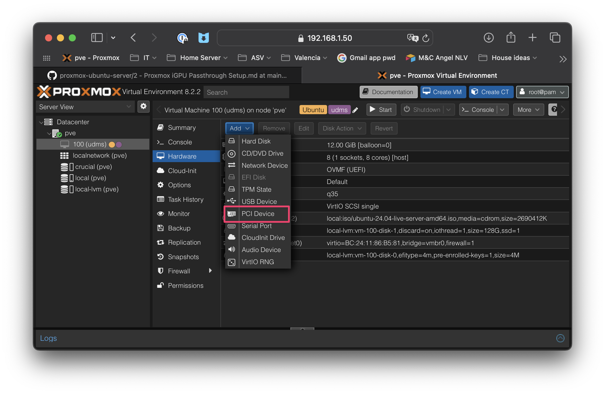

4 - USB Drive Passthrough to Ubuntu VM in Proxmox
===================================================

# Contents
  - [Within Proxmox Node: Pass through from Proxmox node to VM](#within-proxmox-node-psss-through-from-proxmox-node-to-vm)
  - [Within the VM: Set up the mount point and mount the USB drive partition](#within-the-vm-set-up-the-mount-point-and-ount-the-usb-drive-partition)
  - [Within the VM:  Set up `fstab` so passed-through drive will mount on boot](#within-the-vm--set-up-fstab-so-passed-through-drive-will-mount-on-boot)
----
> **NOTE:** Do these steps AFTER you have created the Ubuntu VM!
# Within the Proxmox node (`pve`):
## Pass through from Proxmox node to VM

> ***NOTE:*** Watch this video for a good overview of the process https://www.youtube.com/watch?v=U-UTMuhmC1U
1. Plug in the USB drive (duh!)
2. Go to Proxmox GUI node (usually `pve`) and disks to note which drive you want to pass through: `pve --> Disks`
3. Note the VM number you want to pass the disk through to: `[VM-ID]`
4. Enter in `pve` terminal or shell to get list of connected drives by ID. Note the ID for your USB drive: `[DISK-ID]`
   ```shell
   ls -n /dev/disk/by-id/
   ```
5. To pass through drive to your VM:
   ```shell
   /sbin/qm set [VM-ID] -virtio2 /dev/disk/by-id/[DISK-ID]
   ```

   EXAMPLE:
     ```shell
   /sbin/qm set 100 -virtio2 /dev/disk/by-id/usb-Micron_CT4000X9SSD9_2332E8DB05F5-0:0
   ```
  
# Within the Proxmox GUI VM setup page
## Verify your drive is passed through and turn off backup
> **NOTE:** These steps can only be done after you have created a VM and only affect that VM.
>

1. In Proxmox GUI, verify your disk ia passed through to your VM
```
pve —> [VM#] —> Hardware —> Hard Disk
```
2. In Proxmox GUI, double-click your disk and uncheck `Backup`

ADD NEW PICTURE HERE:
   

# Within the running Ubuntu VM:
## Mount the passed-through drive
Set up the mount point and mount the USB drive partition
1. Switch to VM console
2. Find out your passed-through drive partition name (something like `/dev/sda1` or `/dev/vda1`)
   ```sh
   lsblk
   ```
4.  Create the mount point
   ```shell
   sudo mkdir /mnt/crucial
   ```
4. Mount the passed-through drive to the VM mount point
   ```sh
   sudo mount /dev/vda1 /mnt/crucial
   ```
5. Verify mount using `df` or `mount` methods
   ```sh
   df -h
   ```
   or
      ```sh
   mount
   ```
6. List files on the passed-through USB drive
   ```sh
   cd /mnt/crucial
   ls -al
   ``` 
## Set up `fstab` so the passed-through drive will mount on boot
1. Edit the `fstab` file
   ```sh
   sudo nano /etc/fstab
   ```
2. Add the following line
   ```EditorConfig
   /dev/vda1   /mnt/crucial   ext4    defaults     0        2
   ```
3. Test by mounting all file systems in `fstab`
   ```sh
   sudo mount -av
   ```
# Next Steps

~~[1 - Set up Proxmox from scratch](1%20-%20Proxmox%20Setup.md)~~

~~[2 - Ubuntu VM installation within Proxmox](2%20-%20Ubuntu%20VM%20Installation%20within%20Proxmox.md)~~

~~[3 - iGPU Hardware Passthrough Setup](3%20-%20iGPU%20Hardware%20Passthrough%20Setup.md)~~

~~[4 - USB Drive Hardware Passthrough Setup](4%20-%20USB%20Drive%20Hardware%20Passthrough%20Setup.md)~~

[5 - Ubuntu OS setup](5%20-%20Ubuntu%20OS%20Setup.md)
